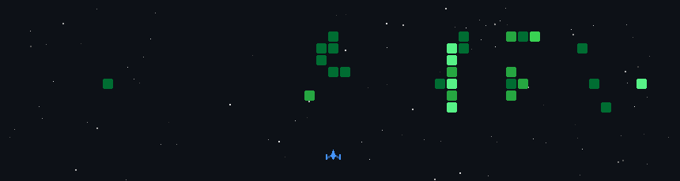

# Hi, I'm Tulsi Chaudhari

### Full Stack Developer · AI/ML Enthusiast · App Developer

 

---

## About Me

<table>
<tr>
<td width="62%" valign="top">

I'm a **B.Tech CSE** student at **VIT Bhopal University** who enjoys turning ideas into practical software.

| | |
|---|---|
| **Building** | Full stack web and mobile apps with React, React Native, Node.js and Express |
| **Learning** | AWS, cloud technologies and software engineering |
| **Exploring** | AI/ML and computer vision through deep learning and OpenCV |
| **Practising** | Competitive programming in C++ on Codeforces |
| **Ask me about** | Python, Java, Android development and databases |

</td>
<td width="38%" valign="top" align="center">

**Quick Facts**

 
 
 
 

</td>
</tr>
</table>

---

## Featured Projects

<table>
<tr>
<td width="50%" valign="top" align="center">
<h3><a href="https://github.com/Tulsi-Chaudhari-16/shipswift">ShipSwift</a></h3>

SaaS platform for last-mile delivery with customer, agent and admin roles, live map tracking, automated agent dispatch and audit history

   
</td>
<td width="50%" valign="top" align="center">
<h3><a href="https://github.com/Tulsi-Chaudhari-16/HeartCare">HeartCare</a></h3>

Healthcare app with patient management, doctor reports, hospital mapping and an ML service for heart-related analysis

   
</td>
</tr>
</table>

---

## Currently Building

<table>
<tr>
<td width="50%" valign="top" align="center">
<h3>InspectLoop</h3>

Agentic surface-defect inspection agent for the <b>OpenCV AI Competition 2026</b> (team AT)

  
</td>
<td width="50%" valign="top" align="center">
<h3>Competitive Programming</h3>

Working through Codeforces problem sheets in C++ to sharpen DSA and problem solving

 
</td>
</tr>
</table>

## Tech Stack

**Languages**

       

**Frontend & Mobile**

   

**Backend**

   

**Databases & Cloud**

   

**AI / ML**

 

**Tools**

  

---

## GitHub Stats

---

**Always happy to collaborate on full stack, cloud or AI projects.**

&nbsp;&nbsp;

